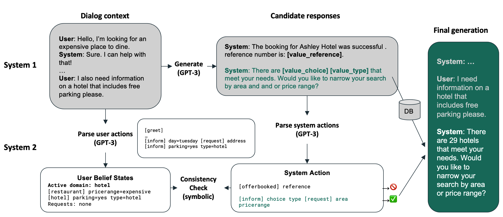

# Neuro-Symbolic Dialogue System
Large language models are notoriously uncontrollable when it comes to autoregressive generation. Recent alignment methods, such as RLHF, have made significant progress in making LLM more useful. However, convincing yet inconsistent generations still persist.

To make generative AI more reliable, we experiment with a task-oriented dialog system based on GPT-3 infused with neuro-symbolic rules. 
When evaluated on MultiWOZ 2.2, the proposed dual-system increases task success rate by **16%**, significantly improving generation consistency and coherence.

See our [technical report](report.pdf) for algorithms/models and evaluations.

## Limitations
- Only restaurant and hotel domains are currently supported. However, the approach can be extended to all domains in MultiWOZ by introducing new rules.
- It would be interesting to see if we can use GPT-4's in-context learning to generate reliable rules for new domains.
